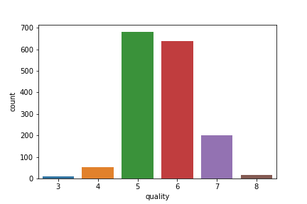
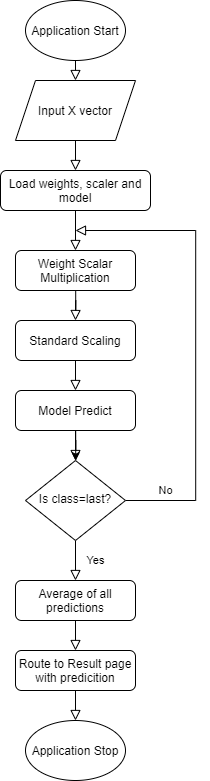
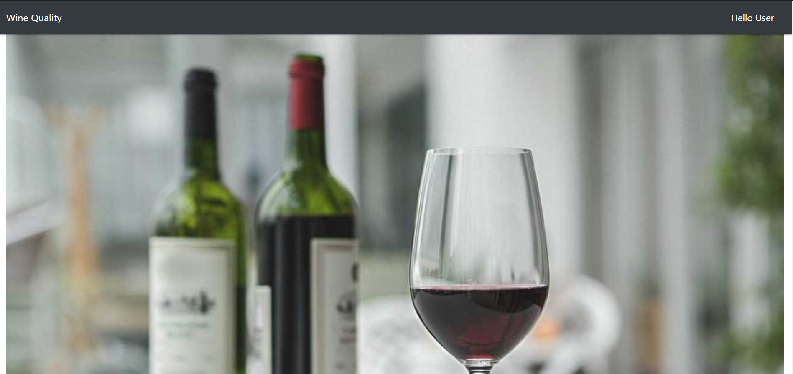
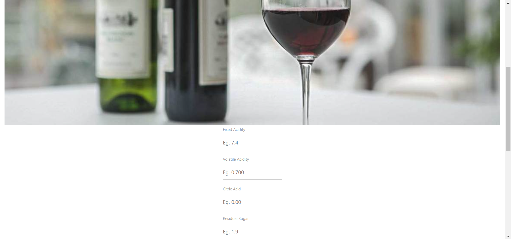
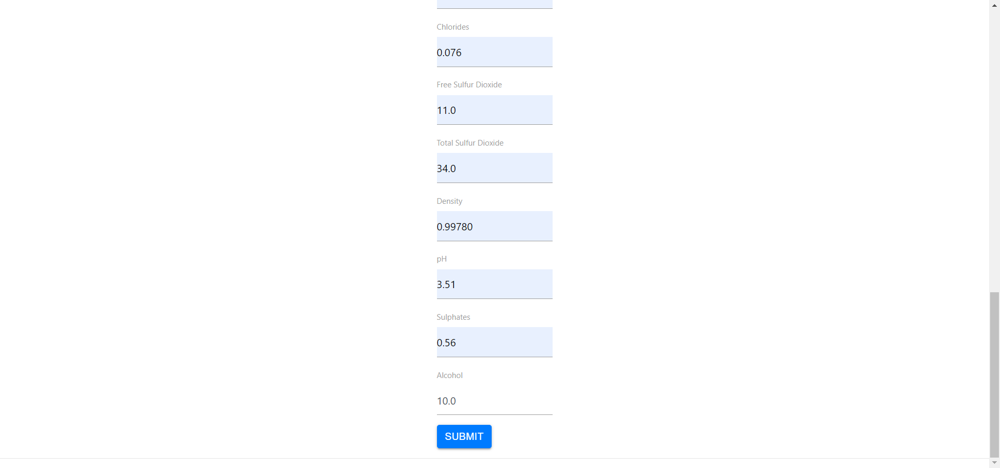
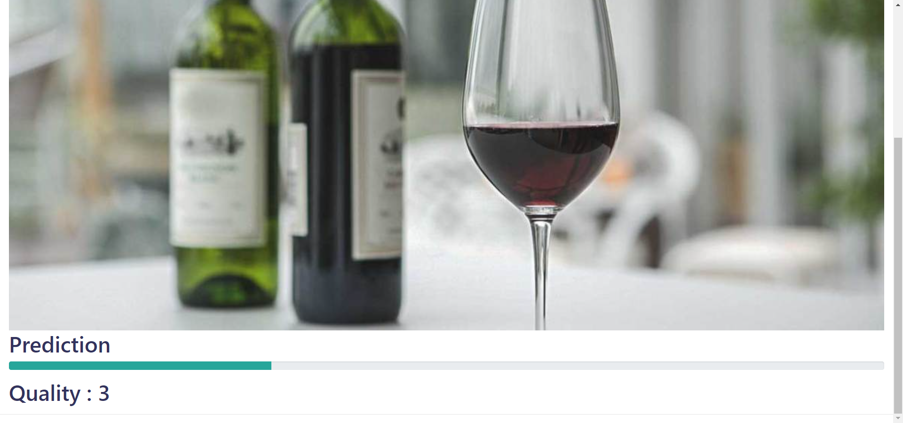

# Red Wine Quality Predictor
### Background Check
4 Ways to Know if Your Wine Is Good
There are 4 simple aspects of a wine to consider when deciding if the wine is of good quality:

#1: Smell
The first is the smell.  Even before you take a sip, stick your nose in the glass and take a whiff – does it smell like wine? Seriously, does it smell fruity or perhaps floral?  If so, it’s passed the first test. If however, it smells like Rover after he’s been swimming or like the soaking wet newspaper you forgot to pick up from the driveway before the storm came – then it’s most likely corked and therefore, no good.

#2: Balance
When a wine is in balance, none of the components of acidity, tannin, alcohol, or fruit stand out as the main event.

Let’s say your wine passes the sniff test. The second clue to knowing if your wine is good is balance.  You may have heard wine experts talking about a “balanced wine” and thought it was more of the usual wine mumbo jumbo. But balance is an important aspect of a wine.  If you had a bottle that was out of balance, you probably wouldn’t like it even if you didn’t know why. 

#3: Depth
Next we want to look at, or actually taste, the depth of flavor in the wine. This is as simple as thinking about what you’re tasting as you hold the wine in your mouth and swirl it around. The wine will almost certainly taste of fruit – but is that all?  Can you detect other layers of flavor beyond the fruit? Perhaps a touch of nuts or grapefruit in a white, or chocolate or coffee in a red? This would suggest a multi-faceted wine with several layers of flavor.

#4: Finish
Lastly, and maybe most easily, another way to determine if your wine is good is to consider its length or finish.  You simply swallow the wine and see how long the flavor lasts on your palate – the longer it lingers, the better the wine.

***Difficult right ! So sit back and relax and let the machine do all the tasks.......***

This application predicts the quality of red wine based on chemical composition details provided by the user. 

The input variables (based on physicochemical tests):

1 - Fixed acidity            2 - Volatile acidity        3 - Citric acid

4 - Residual sugar           5 - Chlorides               6 - Free sulfur dioxide

7 - Total sulfur dioxide     8 - Density                 9 - pH

10 - Sulphates               11 - Alcohol

The Output variable :

1 - quality (score between 3 and 8 inclusive)

## Application Link

<!-- Use the [link](https://red-wine-qlty-pred.herokuapp.com/winequality/) to run the web application on Browser. -->

## Methodology
### Dataset
The Dataset is picked up from Kaggle [link](https://www.kaggle.com/uciml/red-wine-quality-cortez-et-al-2009) and can be seen in the ml_models folder as 'winequality-red.csv'. The dataset is a highly imbalanced one. The dataset is biased towards class 5 and 6.

### Data and Feature Engineering
#### Handling Class Imbalance
The imbalance was handled by the following self devised technique :-
Multiply the reciprocal of value counts of the class to which the datapoint belongs to in the dataset.

Weight of class (W[c]) = 1/(frequency of class c)

X'[i] = W[c]*X[i] (for Y[i]==c).
where X[i] is a row vector of independent varaibles, Y[i] is the target dependent variable and W[c] is a scalar computed above.

This operation improved the model performance drastically which can be seen in the following model performances done with comparative study.

#### Scaling
The data was scaled using the Standard Scalar from Scikit learn library.

### Decomposition
PCA was applied but no such improvement was found in the model performance with PCA. Therefore not used.

### Model Training
Multiple Machine Learning Models were trained to predict the class of the wine being tested using the above mentioned features. Hyperparameter tuning was done to obtain optimum results by iterating over parameters.

| Model with Hyperparameters                                               | Score             | Score w Balancing |
| ------------------------------------------------------------------------ | ----------------- |------------------ |
| Logistic Regression (Unoptimized)                                        | (60.32%, 56.44%)  | (44.07%, 41.48%)  |
| Logistic Regression (C=1, multiclass='ovr',solver='newton-cg')           | (60.60%, 56.63%)  | (69.56%, 68.37%)  |
| Logistic Regression (C=36, multiclass='multinomial',solver='newton-cg')  | (62.46%, 57.20%)  | (92.43%, 92.04%)  |
| Support Vector Classifier (kernel='poly',C=100000)                       | (30.53%, 33.34%)  | (97.39%, 96.40%)  |
| Support Vector Classifier (kernel='linear',C=1)                          | (60.13%, 55.87%)  | (79.74%, 42.23%)  |

Therefore it was seen that balancing operation improved model performance. Hence further hyperparameter tuning was done with graphical study to obtain optimum parameters for Support Vector Classifier. 

Best fit model -> SVC(kernel='linear',C=100,decision_function_shape='ovo',gamma=0.01)
with score -> (99.72%, 99.81%)

### Novelty Of work
Used the inverse frequency technique of handling imbalanced dataset.

### How to Use
Step-1 Open the application in the browser.
Step-2 Scroll down.
Step-3 Enter the input parameters obtained using physicochemical tests.
Step-4 Click on submit button to predict your wine quality.
Step-5 Tada! There you have your predicted output in the range of 3-8. Enjoy!!!

### Application Deployment
The model is deployed using Django framework with templating for basic frontend. The Django application is deployed on Heroku.

Flowchart of application process :-

### Screenshots

<!-- 

 -->
